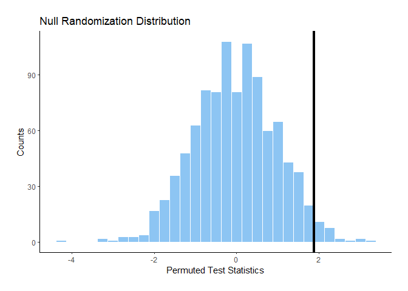
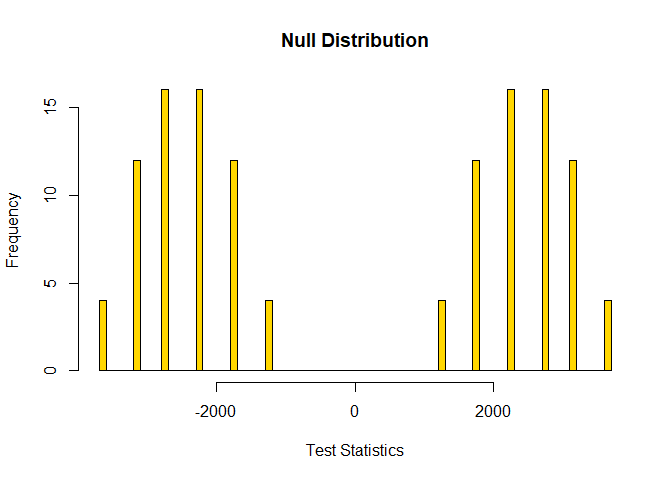
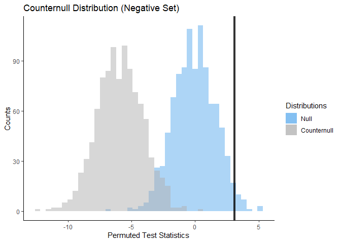
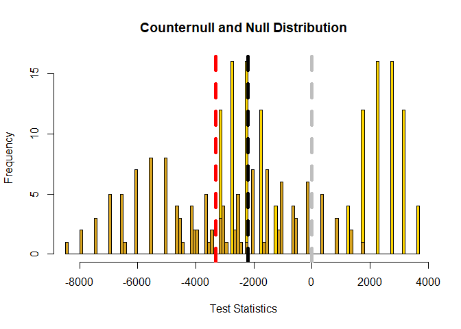

<!-- README.md is generated from README.Rmd. Please edit that file -->

# Counternull

<!-- badges: start -->

<!-- badges: end -->

Counternull package allows users to resample data for
randomization-based testing. Users may generate null randomization
distributions from their own datasets and calculate tests statistics and
P-values. This package allows users to identify counternull sets in a
dataset and plot counternull randomization distributions. The ability
for users to obtain both P-values and counternull sets from a dataset
helps prevent against common misinterpretations in hypothesis testing.

## Installation

You can install the released version of Counternull from
[CRAN](https://CRAN.R-project.org) with:

``` r
install.packages("Counternull")
```

## Usage

Examples of functions that can be used in Counternull Package:

``` r
library(Counternull)
## prints test statistic and P-value from dataset
## plots null distribution of given dataset
## dashed black line: test statistic
create_null_distribution(sample_district_1DS,0,rand_matrix_1DS,
permutation_null_diff_means,find_test_stat_diff_means(sample_district_1DS,
sample_district_1DS$charge_prosecuted_1000_rate_post -
sample_district_1DS$charge_prosecuted_1000_rate_pre),
sample_district_1DS$charge_prosecuted_1000_rate_post -
sample_district_1DS$charge_prosecuted_1000_rate_pre,128)
#> [1] -2215.128
#> [1] 0.375

## prints counternull values of given data set
## plots null and counternull distribution from dataset
## dashed black line: test statistic,
## dashed red line: counternull value,
## dashed gray line: 0
find_counternull_values(.375,sample_district_1DS,0,rand_matrix_1DS,
permutation_null_diff_means,permutation_counter_diff_means,
-8000,0, find_test_stat_diff_means(sample_district_1DS,
sample_district_1DS$charge_prosecuted_1000_rate_post -
sample_district_1DS$charge_prosecuted_1000_rate_pre),
sample_district_1DS$charge_prosecuted_1000_rate_post-
sample_district_1DS$charge_prosecuted_1000_rate_pre,128,7)
#>   [1] -3323 -3322 -3321 -3320 -3319 -3318 -3317 -3316 -3315 -3314 -3313 -3312
#>  [13] -3311 -3310 -3309 -3308 -3307 -3306 -3305 -3304 -3303 -3302 -3301 -3300
#>  [25] -3299 -3298 -3297 -3296 -3295 -3294 -3293 -3292 -3291 -3290 -3289 -3288
#>  [37] -3287 -3286 -3285 -3284 -3283 -3282 -3281 -3280 -3279 -3278 -3277 -3276
#>  [49] -3275 -3274 -3273 -3272 -3271 -3270 -3269 -3268 -3267 -3266 -3265 -3264
#>  [61] -3263 -3262 -3261 -3260 -3259 -3258 -3257 -3256 -3255 -3254 -3253 -3252
#>  [73] -3251 -3250 -3249 -3248 -3247 -3246 -3245 -3244 -3243 -3242 -3241 -3240
#>  [85] -3239 -3238 -3237 -3236 -3235 -3234 -3233 -3232 -3231 -3230 -3229 -3228
#>  [97] -3227 -3226 -3225 -3224 -3223 -3222 -3221 -3220 -3219 -3218 -3217 -3216
#> [109] -3215 -3214 -3213 -3212 -3211 -3210 -3209 -3208 -3207 -3206 -3205 -3204
#> [121] -3203 -3202 -3201 -3200 -3199 -3198 -3197 -3196 -3195 -3194 -3193 -3192
#> [133] -3191 -3190 -3189 -3188 -3187 -3186 -3185 -3184 -3183 -3182 -3181 -3180
#> [145] -3179 -3178 -3177 -3176 -3175 -3174 -3173 -3172 -3171 -3170 -3169 -3168
#> [157] -3167 -3166 -3165 -3164 -3163 -3162 -3161 -3160 -3159 -3324 -3325 -3326
#> [169] -3327 -3328 -3329 -3330 -3331 -3332 -3333 -3334 -3335 -3336 -3337 -3338
#> [181] -3339 -3340 -3341 -3342 -3343 -3344 -3345 -3346 -3347 -3348 -3349 -3350
#> [193] -3351 -3352 -3353 -3354 -3355 -3356 -3357 -3358 -3359 -3360 -3361 -3362
#> [205] -3363 -3364 -3365 -3366 -3367 -3368 -3369 -3370 -3371 -3372 -3373 -3374
#> [217] -3375 -3376 -3377 -3378 -3379 -3380 -3381 -3382 -3383 -3384 -3385 -3386
#> [229] -3387 -3388 -3389 -3390 -3391 -3392 -3393 -3394 -3395 -3396 -3397 -3398
#> [241] -3399 -3400 -3401 -3402 -3403 -3404 -3405 -3406 -3407 -3408 -3409 -3410
#> [253] -3411 -3412 -3413 -3414 -3415 -3416 -3417 -3418 -3419 -3420 -3421 -3422
#> [265] -3423 -3424 -3425 -3426 -3427 -3428 -3429 -3430 -3431 -3432 -3433 -3434
#> [277] -3435 -3436 -3437 -3438 -3439 -3440 -3441 -3442 -3443 -3444 -3445
```



    #> [1] -2215.128
    #> [1] 0.375



## License

[MIT](https://choosealicense.com/licenses/mit/)
