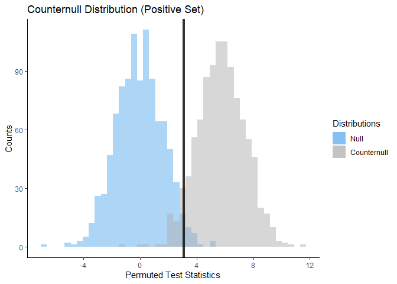

<!-- README.md is generated from README.Rmd. Please edit that file -->

# Counternull

<!-- badges: start -->
<!-- badges: end -->

Counternull package allows users to conduct Randomization-Based
Inference for customized experiments.Users may use the package to
compute Fisher-Exact P-Values alongside null randomization
distributions.Additionally, users can retrieve counternull sets,
generate counternull distributions, compute Fisher Intervals, and
Fisher-Adjusted P-Values. The package may be used on data of any size
and distribution including usage with custom made test statistics.

## Installation

You can install the released version of Counternull from
[CRAN](https://CRAN.R-project.org) with:

``` r
install.packages("Counternull")
```

## Usage

Examples of functions that can be used in Counternull Package:

``` r
library(Counternull)
y = sample_data$turn_angle
w = sample_data$w
n_r = create_null_rand(y, w, sample_matrix, test_stat = c("t"))
summary(n_r)
#> Observed test statistic: 1.88171 
#> Number of extreme test statistics: 56 
#> P-value: 0.056 
#> Alternative: two-sided
plot(n_r)
```


``` r

n_r = create_null_rand(sample_data$turn_angle, sample_data$w,
sample_matrix, test_stat = c("diffmeans"))
c = find_counternull_values(n_r)
summary(c)
#> Counternull Set (Positive): [ 5.782512 , 5.817145 ] 
#> Counternull Set (Negative): [ -5.851778 , -5.841883 ]
plot(c)
```



## License

[MIT](https://choosealicense.com/licenses/mit/)
